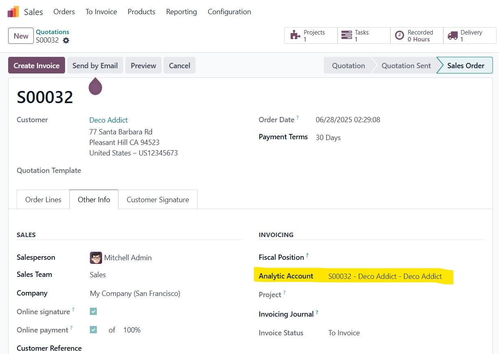
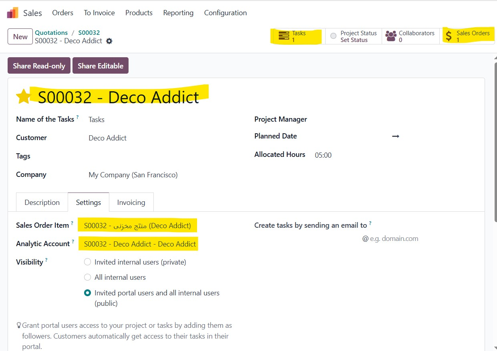
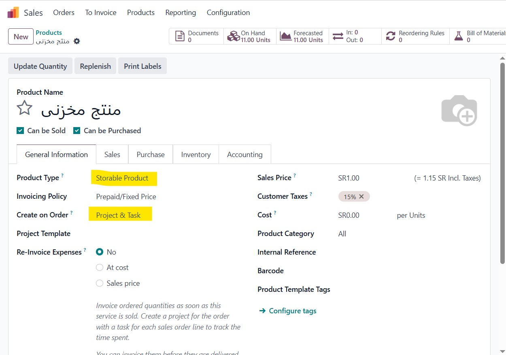
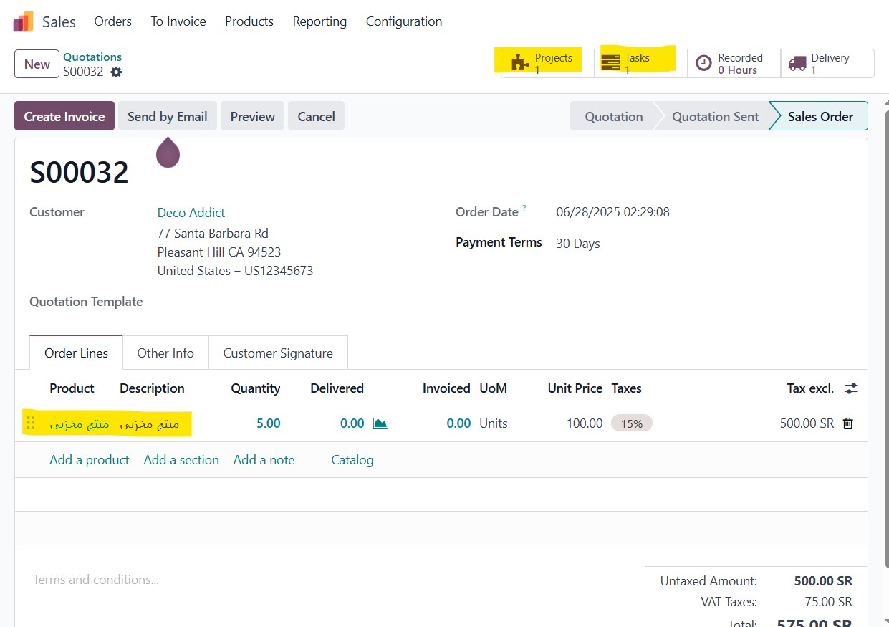

# Storable Product as Service

This module customizes Odoo to allow storable products (type='product') to support features typically exclusive to service products:
- Project and task creation on sales
- Timesheet tracking and invoicing
- Custom project naming with customer name (e.g., S00039-Customer-Name)
- Enhanced tooltip and invoice policy behavior

### 1. Analytic Account

### 2. Sale Order Behavior

### 3. Storable product as service

### 4. Project & Task Auto-Creation
